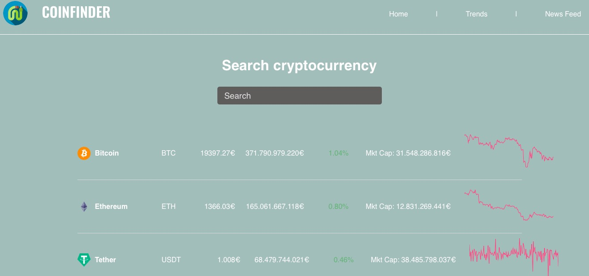

## Proyecto final

### Table of contents

- [Overview](#overview)
  - [Screenshot](#screenshot)
  - [Links](#links)
- [My process](#my-process)
  - [Built with](#built-with)
  - [What I learned](#what-i-learned)
  - [Continued development](#continued-development)
  - [Useful resources](#useful-resources)

- [Acknowledgments](#acknowledgments)

[Overview](#overview)

Web creada con React que trae datos de cotizaciones y noticias de criptomonedas .

Los usuarios pueden filtrar  y consultar el detalle de cada moneda.

Wireframes : https://share.balsamiq.com/c/gHtzzycPuPRAqfgHK7gTKT.png
Deployment con Netlify: https://proyecto-final-sergio-sancho.netlify.app

#### Screenshot

#### Links

- [live site url](https://proyecto-final-sergio-sancho.netlify.app)

#### My process
    1. Romper el UI en componentes : en React una aplicación consiste en    componentes 
    independientes y reutilizables así que el primer paso es definir estos.
    Para determinar qué es un componente el [principio de responsabilidad única](https://en.wikipedia.org/wiki/Single_responsibility_principle) ayuda.
  2. Creas la versión estática 
  3. Implementas los estados **mínimos**  : sólo aquellos estados imprescindibles ,no si se pueden pasar por Props o calcularlos desde otro dato.
  4. Añades las funciones para mutar el estado y hacer la aplicación interactiva.

#### Built with

- Semantic HTML5 markup
- Flexbox
- CSS Grid
- [React](https://reactjs.org/) - JS library
- [React-router](https://reactrouter.com/en/main)-Para rutas de lado del cliente
- [Styled Components](https://styled-components.com/) - Para inyectar CSS en Javascript
- [Axios](https://axios-http.com/es/docs/intro -Para llamadas a la API
- [Chart.js](https://www.chartjs.org)-Para crear gráficos
- [react-char-js-2](https://www.npmjs.com/package/@cubetiq/react-chart-js) -Proporciona más tipos de gráficos sobre chart.js
- [Jest](https://jestjs.io) -Para los test 
 
#### What I learned
Entender como funciona Line de chart.js y como pasarle la configuración :
-Obtienes via API rest el listado de coins
-En cada coin viene un atributo sparkline como un array de precios
-Al componente Coin le pasas el sparkline como props
-Dentro de Coin  creas un objeto de configuración con el formato que espera Chart.js,aquí es  necesario usar los datos de sparkline.

#### Continued development

#### Useful resources

- [RapidAPI](https://rapidapi.com/hub) -Dos de las API usadas.
- [Thinking in React](https://reactjs.org/docs/thinking-in-react.html) - Me ayudó a entender mejor como funciona React. 
- [React tutorial Tania Rascia](https://www.taniarascia.com/getting-started-with-react/) - Muy buen artículo para empezar con React 
- [The Markdown Guide](https://www.markdownguide.org/)
- [Flaticon](https://www.flaticon.es)- Iconos 
- [Paleta de colores](https://coolors.co)

#### Acknowledgments

- [Fundación Adecco](https://fundacionadecco.org)
- [General Assembly](https://generalassemb.ly)

